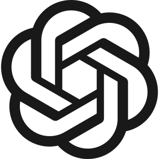

I go by Majid · [@umfhero](https://github.com/umfhero)

Cyber security graduate and AI developer based in London, focused on making AI systems more deterministic, reliable and useful across security and real-world workflows.

<table width="100%">
  <tr>
    <td width="50%" align="center" valign="top">
      <picture>
        <source media="(prefers-color-scheme: dark)" srcset="https://github-profile-summary-cards.vercel.app/api/cards/stats?username=umfhero&amp;theme=github_dark" />
        
      </picture>
    </td>
    <td width="50%" align="center" valign="top">
      <picture>
        <source media="(prefers-color-scheme: dark)" srcset="https://github-profile-summary-cards.vercel.app/api/cards/repos-per-language?username=umfhero&amp;theme=github_dark" />
        
      </picture>
    </td>
  </tr>
</table>

  <picture>
    <source media="(prefers-color-scheme: dark)" srcset="https://github-readme-activity-graph.vercel.app/graph?username=umfhero&amp;theme=github-compact&amp;hide_border=true&amp;area=true" />
    
  </picture>

  <picture>
    <source media="(prefers-color-scheme: dark)" srcset="https://streak-stats.demolab.com?user=umfhero&amp;theme=github-dark-blue&amp;hide_border=true" />
    
  </picture>

### Stack

<table width="100%">
  <tr>
    <td width="22%" valign="top"><strong>AI &amp; Automation</strong></td>
    <td valign="top">
      <strong>Models &amp; tools</strong> 
      <picture><source media="(prefers-color-scheme: dark)" srcset="https://cdn.simpleicons.org/anthropic/ffffff" /></picture>&nbsp;<picture><source media="(prefers-color-scheme: dark)" srcset="assets/gpt-dark.svg" /></picture>&nbsp;<picture><source media="(prefers-color-scheme: dark)" srcset="https://cdn.simpleicons.org/googlegemini/ffffff" /></picture> 
      Claude · GPT · Gemini · Qwen · DeepSeek · Llama · Ollama  
      <strong>Applied capabilities</strong> 
      Deterministic AI design · Frontier-model reliability · Hallucination mitigation · Guardrails &amp; structured outputs · Trust scoring · Model evaluation · LLM API integration · Prompt engineering · RAG · Ontology design · Knowledge graph design · Agentic workflows · Local inference
    </td>
  </tr>
  <tr>
    <td width="22%" valign="top"><strong>Security</strong></td>
    <td valign="top">
      <strong>Tooling</strong> 
      &nbsp;<picture><source media="(prefers-color-scheme: dark)" srcset="https://cdn.simpleicons.org/burpsuite/ffffff" /></picture>&nbsp;<picture><source media="(prefers-color-scheme: dark)" srcset="https://cdn.simpleicons.org/metasploit/ffffff" /></picture>&nbsp;<picture><source media="(prefers-color-scheme: dark)" srcset="https://cdn.simpleicons.org/wireshark/ffffff" /></picture>&nbsp;<picture><source media="(prefers-color-scheme: dark)" srcset="https://cdn.simpleicons.org/owasp/ffffff" /></picture> 
      <strong>Web &amp; network:</strong> Kali Linux · Burp Suite · Nmap · Wireshark · Metasploit · sqlmap · Nikto · Gobuster 
      <strong>Reverse engineering, password &amp; forensics:</strong> x64dbg · WinDbg · Ghidra · Volatility · Autopsy · Hashcat · John the Ripper 
      <strong>Practice:</strong> Penetration testing · Memory analysis · Reverse engineering · OWASP Top 10 · CTFs
    </td>
  </tr>
  <tr>
    <td width="22%" valign="top"><strong>Languages</strong></td>
    <td valign="top">
       
      Python · TypeScript · JavaScript · Java · C# · C++ · SQL · Cypher · Verse
    </td>
  </tr>
  <tr>
    <td width="22%" valign="top"><strong>Frameworks &amp; Infrastructure</strong></td>
    <td valign="top">
       
      Electron · React · Node.js · Docker · Git · GitHub · Kuzu · Cloudflare Workers AI · Linux
    </td>
  </tr>
</table>
